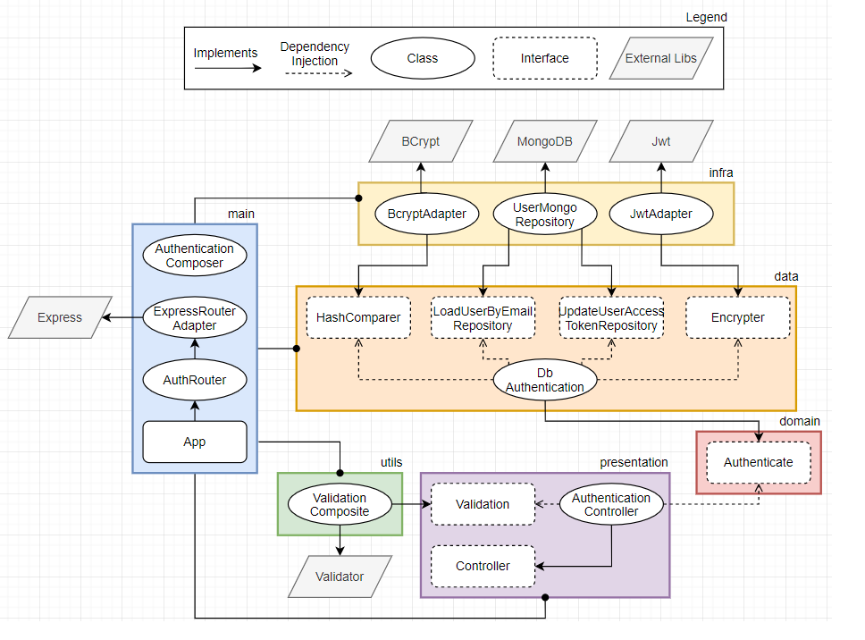

# Authentication

> ## Success Case

1. ✅ Receive a request of type **POST** on rote **/api/auth**
2. ✅ Validate required data **email** and **password**
3. ✅ Validate **email** field is a valid email
4. ✅ **Find** user with email and password provided
5. ✅ Create an access **token** from user ID
6. ✅ **Update** user data with created access token
7. ✅ Return **200** with an accessToken and the user email

> ## Exceptions

1. ✅ Returns an error **404** if the API dont exist
2. ✅ Returns an error **400** if email or password are not provided by the client
3. ✅ Returns an error **400** if the email field is a invalid email
4. ✅ Returns an error **401** if an user is not founded with the provided data
5. ✅ Returns an error **500** if it goes wrong create a access token
6. ✅ Returns an error **500** if it goes wrong on update user created access token

> ## Diagram

