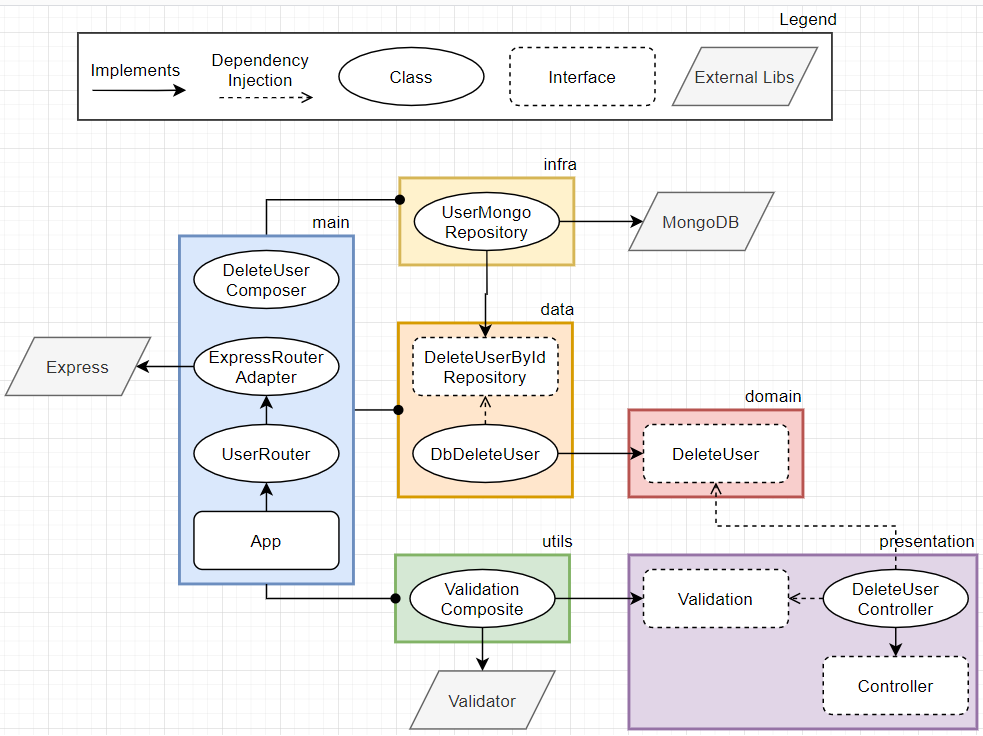

# Delete User

> ## Success Case

1. ✅ Receive a request of type **DELETE** on rote **/api/delete**
2. ✅ Authenticate **accessToken** if is **admin**
3. ✅ Validate required **id**
4. ✅ Return **200** if user has delete

> ## Exceptions

1. ✅ Returns an error **404** if the API dont exist
2. ✅ Returns an error **401** if no accessToken is provided
3. ✅ Returns an error **403** if accessToken is invalid
4. ✅ Returns an error **400** if no id is provided
5. ✅ Returns an error **404** if an error accours when is tried found user with provided id
6. ✅ Returns an error **500** if an error accours when is tried delete user by id

> ## Diagram

