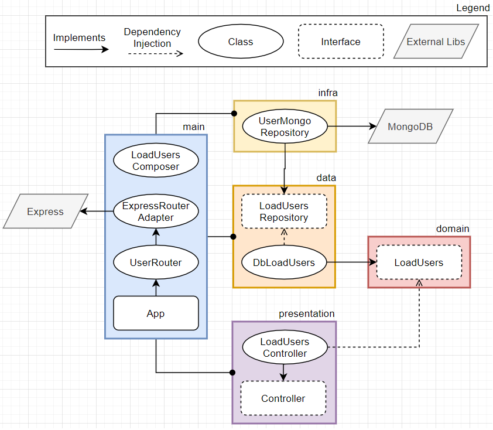

# Load Users

> ## Success Case

1. ✅ Receive a request of type **GET** on rote **/api/users**
2. ✅ Return **204** if no user is found
3. ✅ Return **200** with all user records

> ## Exceptions

1. ✅ Returns an error **404** if the API dont exist
2. ✅ Returns an error **500** if it goes wrong on load users

> ## Diagram

