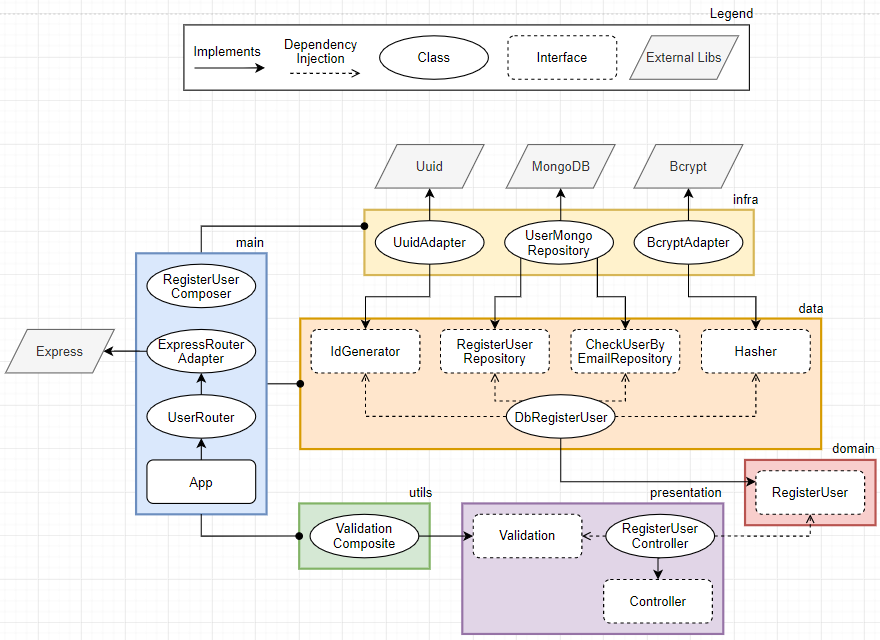

# Register User

> ## Success case

1. ✅ Receive a request of type **POST** on rote **/api/register**
2. ✅ Authenticate **accessToken** if is **admin**
3. ✅ Validate required data **email** and **password**
4. ✅ Validate **password** are equals
5. ✅ Validate **email** field is a valid email
6. ✅ **Validate** if the past email already been used by another user
7. ✅ Generate a **uuid**
8. ✅ Generate a **encrypted** password
9. ✅ **Register** an user with the passed data with the encrypted password, uuid and email
10. ✅ Returns **200** with the user email

> ## Exceptions

1. ✅ Returns an error **404** if the API dont exist
2. ✅ Returns an error **401** if no accessToken is provided
3. ✅ Returns an error **403** if accessToken is invalid
4. ✅ Returns an error **400** if email or password are not provided
5. ✅ Returns an error **400** if the email field is a invalid email
6. ✅ Returns an error **403** if the email provided is already in use
7. ✅ Returns an error **500** if an error accours when is tried to check if user email already exist
8. ✅ Returns an error **500** if an error accours when is tried to generate an uuid
9. ✅ Returns an error **500** if an error accours when is tried to created a encrypted password
10. ✅ Returns an error **500** if an error accours when is tried to create a user to register

> ## Diagram

